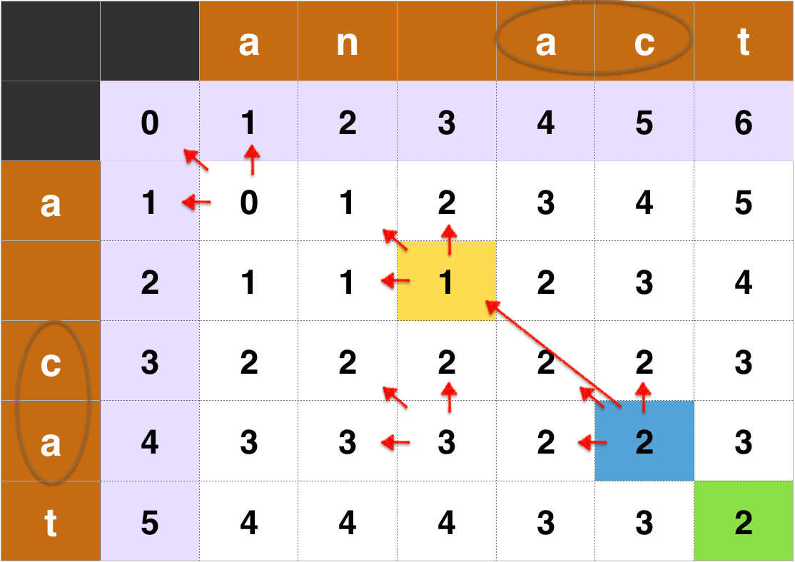
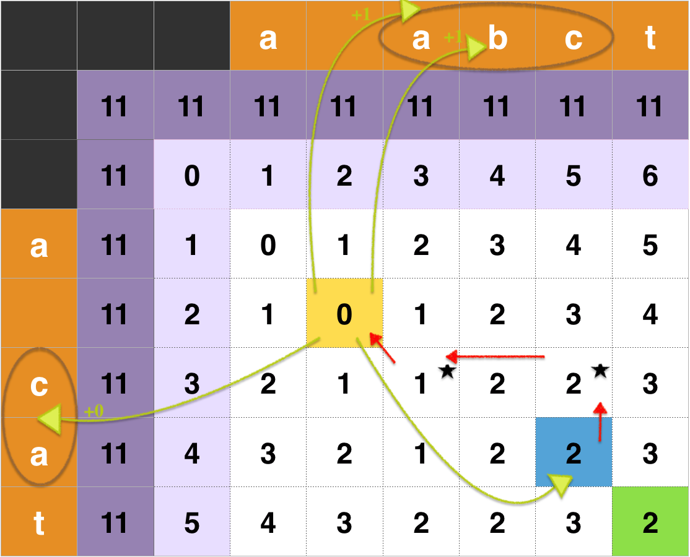

# Understanding Edit Distances

Repository: https://github.com/pharo-ai/edit-distances 

In this tutorial we're going to see what edit distance is about and some cool applications in everyday life that are implemented with this distance metrics. First of all, let's explain what is an edit distance.
Given two strings (finite sequence of symbols) $s_1$ and $s_2$, the edit distance between them is the minimum number of edit operations required to transform $s_1$ into $s_2$. So we can say that with this distance we able to measure the similarity of corresponding symbols. The basic edit operations here are: 

• Substitutions  
• Deletions  
• Insertions 

We say basic for operations because when changing one string into another we usually have to subsitute, delete or insert a character or a symbole (depends on what you're working with). Say you want to write `fork` but instead you wrote `zork`, to correct this sadly mistake you subtitute the `z` for `f`. If we give to this operation the value of 1 (common given value), then `zork` is _1 edit distance away from `fork`_. There are evidently other operations that one can do such as transpositon. And so the variants of edit distance that exist are obtained by restricting the set of operations or adding more.

Also, Edit Distance has properties of dynamic programming because the basic principle of dynamic programming is to decompose a problem into stages and find optimal solutions for each stage and save each solution. And that is exactly how different edit distance algorithms work. 

 #  How does edit distance algorithm works ? 

 The idea is to build a distance matrix. Here we're going to show the progress of the retricted Damerau-Levenshtein and the full Damerau-Levenshtein algorithm. By explaining these two algorithms you will understand the Levenshtein algorithm as well since they are based on this last one.

### Restricted Damerau-Levenshtein distance :  

For 2 words, such as 'a cat' and 'an act', a matrix of size 5x6 is created as shown in the next figure. Note that the row and column surrounded by purple are not part of the matrix they are just added for clarity. 

For calculating the cost of each cell we procede by using this equation :

    

We can represent this equation with the matrix bellow. Note that the min caculated is represented by the red arrows.




### Damerau-Levenshtein distance :

For 2 words, such as 'a cat' and 'an abct', a matrix of size 5x6 is created as shown in the next figure. Note that the row and column surrounded by purple are not part of the matrix they are just added for clarity. 




#  What they are used for ?

The usefulness of edit distances differs from one use to another. By default, a lower distance implies greater similarity between two words. However, in NLP(Natural Language Processing) we generally wish to minimize the distance, not being the case in computational biology where we wish to maximize similarity. Or even in error correcting codes, where we wish to maximize the distance so that one codeword is not easily confused with another. There are many application domains where you might find the utilisation of edit distance such as:

- **Spelling correction** :  For example a user typed `graffe`, which word is the closest ?
  - graf
  - graft
  - grail
  - giraffe
   
Using the edit distance metric we can affirm that `giraffe` is the closest. That's how correcting spelling works. It compares every word typed with thousands of correctly spelled words and then uses the edit distance metric to determine the correct spellings by choosing the lowest distance between the typed word and the words of our dictionary.
  
- **DNA sequence alignment** - [Example](#dna-sequence-alignments) : We might want to know the purpose of sequence alignment, well it's important when identifying regions of similarity that may be a consequence of functional, structural, or evolutionary relationships between the sequences

  
# Some applications in Machine Learning

Just to put in context we're going to quickly prompt the definiton of Machine Learning:  
_It's the use and development of computer systems that are **able to learn and adapt without following explicit instructions**, by using algorithms and statistical models to analyse and draw inferences from patterns in data._
So it's kind of about prediction, we don't have to repeat a task that could be done mechanicaly (automatically) after training our algorithm or machine on a historical dataset and applying to new data. Here are some machine learning domains that use edit distance:

- **Recommendation systems** (use of algorithm that suggests relevant items to users): Using the Cosine Similarity distance, its value which is located in the interval of 0 and 1 represent the percentage of similarity between the items (73%, 50%, ... of similarity).
- **Optical character recognition** : Recognize the off-line characters from text images. Allows you to quickly and automatically digitize a document without the need for manual data entry.
- **Document similarity** : Used in Information Retrieval which goal is to develop a model for retrieving(collecting) information from the repositories of documents.
- **Image Data Matching For Entity Resolution** : Used to track google images results for product design copyright infringement or product matching across different competitors to understand market size or price tracking.
- **Plagiarism detection** <!-- Still in progress -->
# Example

<!--## Spell checker-->

## DNA sequence alignment  

**Computational biology** is a field in which computers are used to do research on biological systems. Here we will compute DNA sequence alignments. The optimization process involves evaluating how well individual base pairs match up in the DNA sequence case. 

**Biology review**: DNA is an acid that contains all of the hereditary genetic information that comes as an "instruction manual". It is composed of four biological macromolecules {Adenine (A), Thymine (T), Guanine (G), Cytosine (C)} that together forme a string called _genetic sequence_.

In bioinformatics, a sequence alignment is a way of arranging the sequences of DNA, RNA, or protein to identify regions of similarity that may be a consequence of functional, structural, or evolutionary relationships between the sequences.

The relation with _**edit distance**? :_   
 The edit-distance is the score of the best possible alignment between the two genetic sequences over all possible alignments.

Given two biological sequences (strings of DNA nucleotides or protein amino acids) of length n , the basic problem of biological sequence comparison can be recast as that of determining the Levenshtein distance between them. Biologists prefer to use a generalized Levenshtein distance where instead of simply counting the number of substitutions, insertions, and deletions, each operation will have a different cost depending on where in the string it is applied; i.e. common substitutions will have a lower cost than uncommon ones.

Below, we show two different pairs of long local alignments of a single pair of strings.
```
 AACGCAAAAACGTCGTCGTTT --> CGCAAAAACGT, CGTCGTCGT
                           :: :::: :::, :::::::::
 TTCGTCGTCGTAAAACGTTAA --> CGTAAAA-CGT, CGTCGTCGT
  ```


### Why sequence alignment?
•  Assembling fragments to sequence DNA  
•  Compare individuals to looking for mutations


<!-- Temporary notes:
    - Computing the standard edit distance can be formulated as an optimization problem and can be carried out with a dynamic programming algorithm.
    - But our focus
    - The logic behind ...

[_General definiton_ ](https://github.com/pharo-ai/wiki/blob/master/wiki/StringMatching/Edit-distances.md) 


 -->